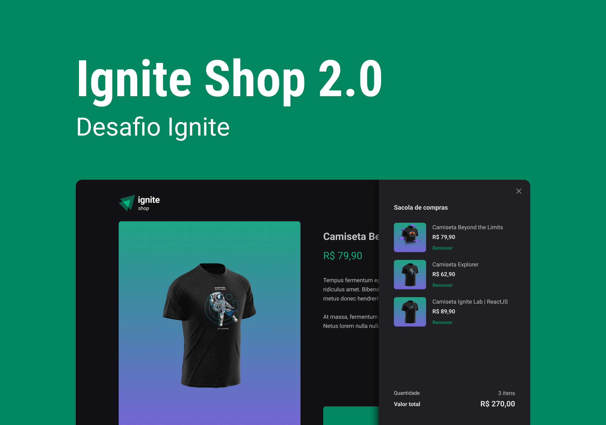

<h1 align="center">
  👕 Ignite Shop
  <hr />
  
</h1>

<p align="center">
  

  

  <a href="https://github.com/amanda-santos/ignite-shop/commits/master">
    
  </a>

  <a href="https://github.com/amanda-santos/ignite-shop/issues">
    
  </a>
</p>

<p align="center">
  <a href="#-about-the-project">About the project</a>&nbsp;&nbsp;&nbsp;|&nbsp;&nbsp;&nbsp;
  <a href="#-layout">Layout</a>&nbsp;&nbsp;&nbsp;|&nbsp;&nbsp;&nbsp;
  <a href="#-technologies">Technologies</a>&nbsp;&nbsp;&nbsp;|&nbsp;&nbsp;&nbsp;
  <a href="#-preview">Preview</a>&nbsp;&nbsp;&nbsp;|&nbsp;&nbsp;&nbsp;
  <a href="#-getting-started">Getting started</a>&nbsp;&nbsp;&nbsp;|&nbsp;&nbsp;&nbsp;
  <a href="#-how-to-contribute">How to contribute</a>&nbsp;&nbsp;&nbsp;
</p>

## 📝 About the project

<p>This is a simulation of a t-shirt online marketplace. Fully responsive and available in English 🇬🇧. 
<br />
Developed as part of Ignite React (Rocketseat) 🚀
</p>

## 🎨 Layout

<p>
  Click <a href="https://www.figma.com/file/saJGy5ELh6Kpw5wQGsJi2c/Ignite-Shop-2.0-(Copy)?node-id=2%3A12&t=jo529UU1EEGMPTBy-1">here</a> to check the layout on Figma.
</p>

## 👩🏻‍💻 Technologies

Technologies used to develop this project:

- Next.js
- React
- TypeScript
- Stitches
- Stripe
- Axios
- Keen Slider
- Phosphor React Icons

## 🖥 Preview


Click <a href="https://ignite-shop-amanda-santos.vercel.app/">here</a> to see it live 📺

## ⌨ Getting started

- Run `npm i` or `yarn` to install the dependencies
- Run the development server with `npm run dev` or `yarn dev`

## 🤔 How to contribute

**Make a fork of this repository**

```bash
# Fork using GitHub official command line
# If you don't have the GitHub CLI, use the web site to do that.

$ gh repo fork amanda-santos/ignite-shop
```

**Follow the steps below**

```bash
# Clone your fork
$ git clone your-fork-url && cd ignite-shop

# Create a branch with your feature
$ git checkout -b my-feature

# Make the commit with your changes
$ git commit -m 'feat: My new feature'

# Send the code to your remote branch
$ git push origin my-feature
```

After your pull request is merged, you can delete your branch

---

Made with 💜 by Amanda Santos
